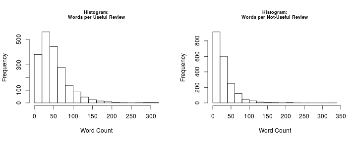

To Write a Useful Yelp Review in Charlotte, NC, Say “Cheese”. Or Write a Longer Review.
========================================================
author: Michael Green
date: November 20, 2015

Introduction
========================================================
47% of Yelp reviews from Yelp Dataset Challenge #6 have at least one vote for "useful".

- Can Topic Modeling reveal themes or words in review text that makes reviews useful? 
- Use data from Charlotte, NC to reduce data set and account for regional preferences.
- Conclusion: Topic Modeling doesn't provide insights desired, however the document term matrices produced suggest more words and more variety of words used in useful reviews.
- R code I created to explore this data and create this report can be found at my [github page](https://github.com/mykelagrene/yelp_proj).

Methods
========================================================
- Created dataframes and merged review data with business data from the json files provided.
- Selected reviews for Charlotte business using geographic latitude and longitude coordinates.
- Separated Charlotte reviews into useful and not-useful datasets. Took 2000 samples from each to create models.
- Distribution of star ratings and business categories similar.
- Created a document corpus and a document term matrix for each sample set using tm package in R.
- Used topicmodels package in R to create models. Used the Latent Dirichlet Allocation with k=20 topics.
- Experimented with restricting vocabulary in document term matrices using term frequency - inverse document frequency.

Results
========================================================
Top Topic: Useful Reviews

```
    Topic.17
1    chicken
2      lunch
3   sandwich
4      place
5      salad
6  delicious
7     little
8      great
9     cheese
10   ordered
```
***
Top Topic: Not Useful Reviews

```
     Topic.17
1       great
2       place
3       pizza
4     service
5     awesome
6      little
7  definitely
8       tacos
9       night
10      fresh
```


Discussion
=========================================================
- Topics reflected business categories: mostly restaurant and food related.
- Not as useful as hoped to differentiate useful vs. not-useful.
- Examination of document term matrices reveal differences in number of words used. Useful reviews have almost twice as many words on average.
 
 
 
